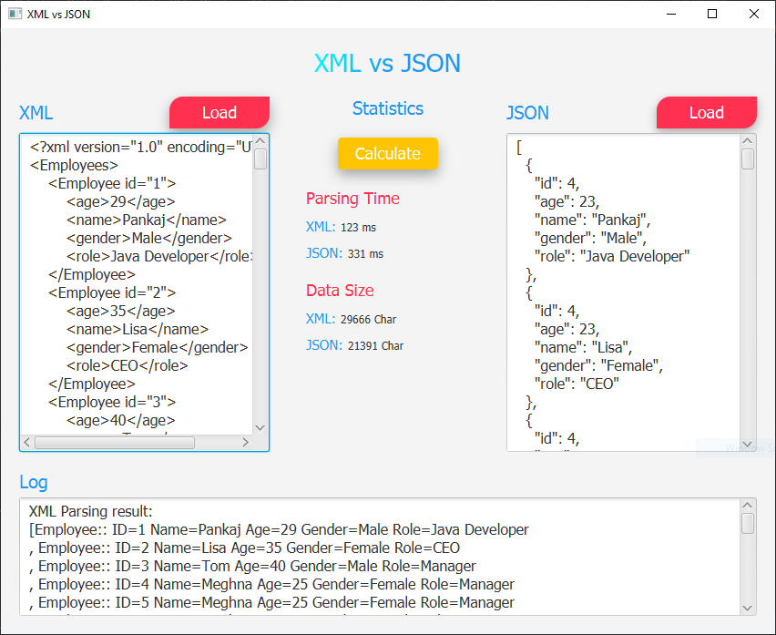

# XML vs JSON
Desktop App demonstrate the comparison between XML and JSON by data size & parsing speed.

## Screenshots
| Main App |
|:-----------:|
|  |

## Requirements
* Java 8
* Maven

## Installation
1. Download the repository files (project) from the download section or clone this project by typing in the bash the following command:

       git clone https://github.com/HouariZegai/XMLvsJSON.git
2. Import it in Intellij IDEA or any other Java IDE and let Maven download the libraries used for you.
3. Run the application :D

## Contributing 💡
If you want to contribute to this project and make it better with new ideas, your pull request is very welcomed.
If you find any issue just put it in the repository issue section, thank you.

## Contact me
Email: houarizegai14@gmail.com  
LinkedIn: [HouariZegai](https://linkedin.com/in/houarizegai)  
Twitter: [@HouariZegai](https://twitter.com/houarizegai)
